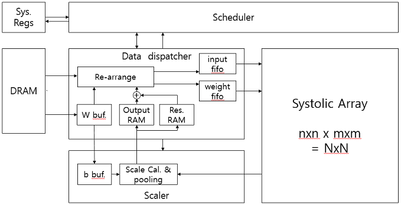

FPGA Convolution accelerator implementation
===========================================

This is a term project repository of the FPGA Convolution accelerator implementation.

Directory structure
------------------

Directory structure is shown belows :

::

   ├── build     #Build scripts. Makefiles are located in.
   ├── host      #Host side. Application code is located in.
   ├── import    #External code. imported code or repository
   └── rtl       #FPGA RTL code.

Design Summary
--------------
1. Classification using 1,000 ImageNet datasets and FPGA.
2. Optimization EfficientNet-lite0 for lightening hardware suitable.


RTL Module
----------
- Scheduler, Data disp., Systolic arr., Scaler modules are implemented by vivado project.
- Function simulation level verified.
- DRAM > Data disp. > Systolic arr. > Scaler > Data disp. > DRAM data path verified.




Host Application
----------------
1. host/hello_world_xrt:
   First, we needed to test XRT `natvie apis <https://xilinx.github.io/XRT/master/html/xrt_native_apis.html>`_ how to it works.
   The hello_world_xrt is copied and modified from `Vitis examples <https://github.com/Xilinx/Vitis_Accel_Examples>`_.

2. host/image_flip:
   To check image load and FPGA work flow, this example was made.

3. host/effinet_hdl_xrt:
   The host program of this project using XRT native apis.


Test Environments
-----------------

Board Setup
```````````
We followed the Xilinx `ug1301 <https://www.xilinx.com/support/documentation/boards_and_kits/accelerator-cards/1_3/ug1301-getting-started-guide-alveo-accelerator-cards.pdf>`_ to bring-up and validate card.
The validation result is:

::

   $ sudo /opt/xilinx/xrt/bin/xbutil validate --device 0000:81:00.1
   Starting validation for 1 devices
   Validate Device           : [0000:81:00.1]
   Platform              : xilinx_u280_xdma_201920_3
   SC Version            : 4.3.10
   Platform ID           : 0x5e278820
   -------------------------------------------------------------------------------
   Test 1 [0000:81:00.1]     : Aux connection
      Test Status           : [PASSED]
   -------------------------------------------------------------------------------
   Test 2 [0000:81:00.1]     : PCIE link
      Test Status           : [PASSED]
            :
   Validation completed. Please run the command '--verbose' option for more details
   Validation Summary
   ------------------
   1  device(s) evaluated
   1  device(s) validated successfully
   0  device(s) had exceptions during validation
   Validated successfully [1 device(s)]

Install Compiler(v++)
`````````````````````

To compile RTL or HDL code, the Vitis compiler(v++) is needed.
We were able to get the compiler by installing the `Vitis <https://www.xilinx.com/html_docs/xilinx2021_1/vitis_doc/index.html>`_.

::

   $ source tools/Xilinx/Vitis/2020.2/settings64.sh
   $ which v++
   /home/user/tools/Xilinx/Vitis/2020.2/bin/v++

How to build
````````````
1. hw mode (making host and .xclbin)

::

   effinet_hdl_xrt$ make all DEVICE=xilinx_u280_xdma_201920_3 TARGET=hw
   g++ -o effinet_hdl_xrt common/includes/cmdparser/cmdlineparser.cpp common/includes/logger/logger.cpp src/host.cpp src/effinet_info.cpp -I/opt/xilinx/xrt/include -I/home/user/tools/Xilinx/Vivado/2020.2/include -Wall -O0 -g -std=c++1y -Icommon/includes/cmdparser -Icommon/includes/logger -fmessage-length=0  -L/opt/xilinx/xrt/lib -lOpenCL -pthread -lrt -lstdc++  -luuid -lxrt_coreutil -lopencv_core -lopencv_imgproc -lopencv_highgui -lopencv_imgcodecs
   :
        
2. host only mode(making host)

::

   effinet_hdl_xrt$ make host
   g++ -o effinet_hdl_xrt common/includes/cmdparser/cmdlineparser.cpp common/includes/logger/logger.cpp src/host.cpp src/effinet_info.cpp -I/opt/xilinx/xrt/include -I/home/user/tools/Xilinx/Vivado/2020.2/include -Wall -O0 -g -std=c++1y -Icommon/includes/cmdparser -Icommon/includes/logger -fmessage-length=0  -L/opt/xilinx/xrt/lib -lOpenCL -pthread -lrt -lstdc++  -luuid -lxrt_coreutil -lopencv_core -lopencv_imgproc -lopencv_highgui -lopencv_imgcodecs
   :
 

Build and Test Results
``````````````````````

::

   user@alveo: effinet_hdl_xrt$ ./effinet_hdl_xrt -x ./build_dir.hw.xilinx_u280_xdma_201920_3/krnl_effnet_inf.xclbin
   Open the device: 0 [time:40142us]
   Load the xclbin instance from ./build_dir.hw.xilinx_u280_xdma_201920_3/krnl_effnet_inf.xclbin file [time:2778015us]
   Get kernel function instance [time:886us]
   Init Buffer in FPGA::Global Memory [time:3963us]
   Write the input data to buffer objects [time:1355us]
   Synchronize in/weight/bias buffers to device global memory [time:1101us]
   Execution of the kernel [time:2879797us]
   Get the output data from the device [time:195us]      

For more comprehensive documentation, `click here <http://xilinx.github.io/Vitis_Accel_Examples>`_.
